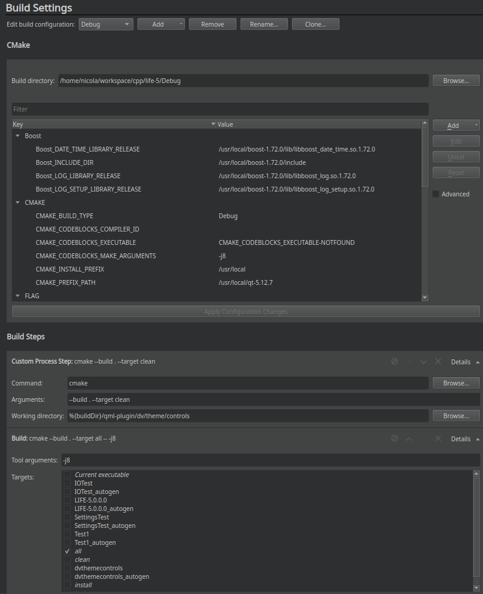

# LIFE-5
========

## Plugin `dv.theme.controls`

Il plugin contiene tutte le informazioni relative al theme dell'applicazione, quindi colori, oggetti qml, script js.

Per la gestione del plugin, ricordarsi di:

1. file `qmldir`: questo file deve contenere la descrizione degli oggetti QML
2. i file `.qml`, una volta che il plugin viene compilato, devono essere copiati all'interno della cartella della build (script automatizzato all'interno di CMakeLists.txt)

### Step per la compilazione del plugin

1. Aprire il progetto con QtCretor selezionando il CMakeLists.txt principale; successivamente, compilare solo il plugin
2. In questo esempio, si ha compilato il plugin al percorso: `~/workspace/cpp/life-5/Debug/`
3. Generazione file `plugins.qmltypes`: questo si genera dopo la compilazione del plugin del punto 1; per la generazione, eseguire i seguenti comandi da bash:
   * `QML2_IMPORT_PATH=~/workspace/cpp/life-5/Debug/qml-plugin/`
   * `export QML2_IMPORT_PATH`
   * `qmlplugindump dv.theme.controls 1.0 > /home/nicola/workspace/cpp/life-5/Debug/qml-plugin/dv/theme/controls/plugins.qmltypes`
   
> Nota: il file `plugins.qmltypes` va all'interno della cartella della build, non della cartella sorgente.

#### NOTE

* *Fare molta attenzione ai percorsi.*  
Esempio: in questo caso si ha:

>* `WORKSPACE-PATH: /home/nicola/workspace/cpp/life-5/src`
>* `PLUGIN-PATH: /home/nicola/workspace/cpp/life-5/src/qml-plugin`
 
>All'interno di un file .qml, la import viene fatta in questo modo: `import dv.theme.controls`  
>Questo perche' ( *IMPORTANTE* ), la import va a guardare le `IMPORT_PATH` di default e quelle successivamente definite attraverso
>la variabile d'ambiente (*non variabile CMAKE*) `QML2_IMPORT_PATH`. Poi, ad ogni '.', va ad osservare la relativa sottocartella!  
>Quindi, la direttiva `import dv.theme.controls`, va a controllare:

>* `QML2_IMPORT_PATH`, e poi
>* `le sottocartelle dv/theme/controls`, associate al percorso `dv.theme.controls`

>Per ulteriori informazioni, vedere il link [identifiedModules](https://doc.qt.io/qt-5/qtqml-modules-identifiedmodules.html)

* *Far funzionare il plugin all'interno di QtCreator*  
Avviare QtCreator in modo che la variabile d'ambiente `QML2_IMPORT_PTH` sia settata prima di avviarlo

=================================
## Creazione progetto QtCreator

Per la creazione del progetto, aprire il CMakeLists.txt presente nella cartella principale.  
Una volta aperto, configurare la modalita' di Debug come da screen qui allegato.

Oltre alla compilazione del progetto normale, e' stata aggiunta una *Custom Process Step*: questo processo non fa altro che fare il clean della cartella relativa al plugin (CMake fa la build anche di sole sottodirectory se specificate, come in questo caso per la working directory impostata a `../qml-plugin/..`); in questo modo le modifiche fatte al volo per la parte del plugin (quindi per la parte del Theme), vengono rese effettive in quanto ricompilate ogni volta.

Per velocizzare la compilazione, nello step della Build e' stato aggiunto il parametro `-j8`, che indica quanti thread usare per la compilazione.

